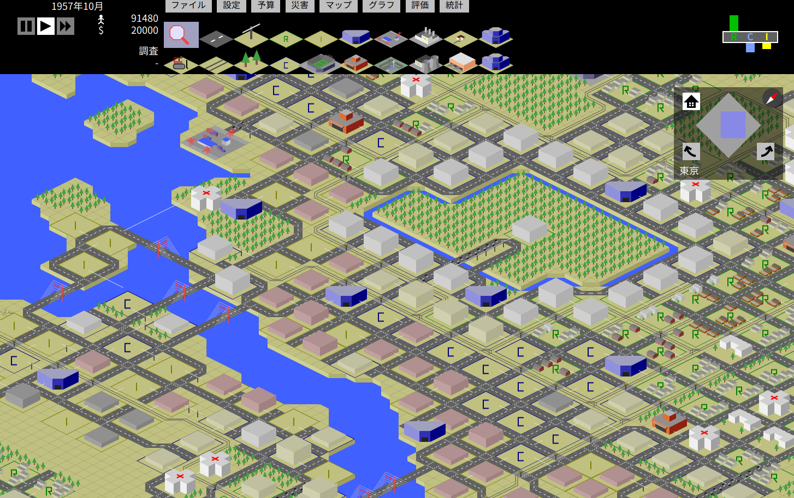
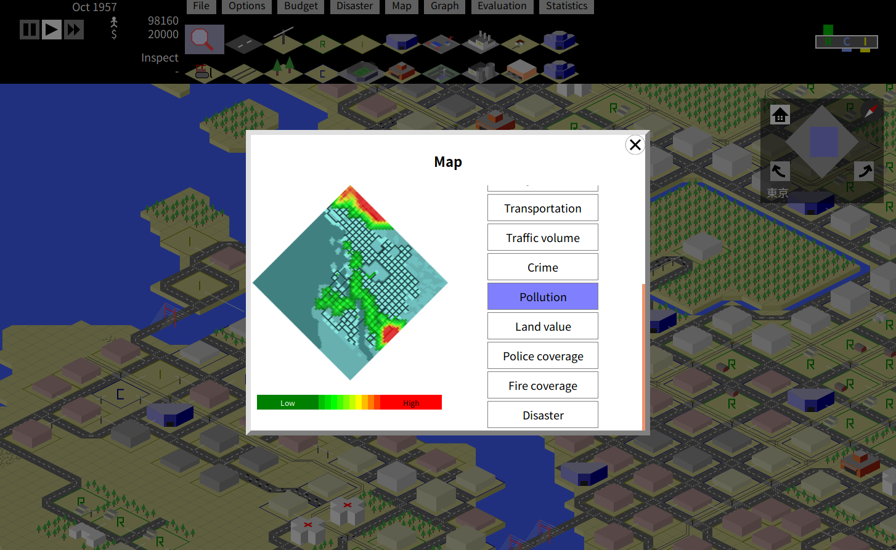
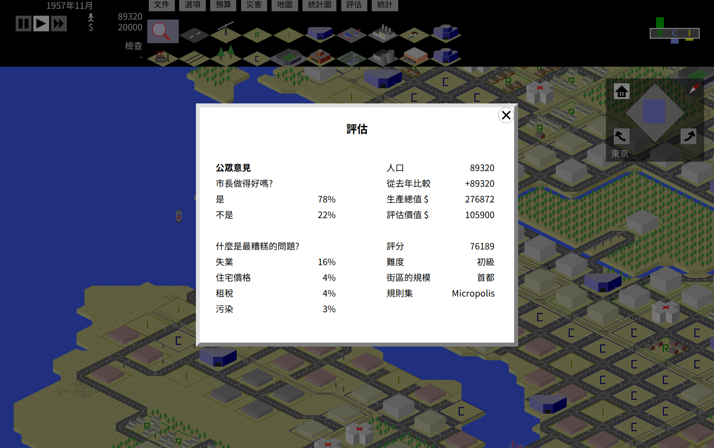

# About TinyCity

TinyCity is a city building game based on SimCity(1989).

You can choose "Micropolis" ruleset which like SNES version of SimCity® and "TinyCity" ruleset which based on SimCity but diffecent.

## How to play

Open index.html in your browser such as Firefox, Chrome or Safari.

Help file (docs/help.en.html) not translated yet.

# TinyCityとは

TinyCityは、初代シムシティを元にした街作りゲームです。

スーパーファミコン版のシムシティーのルールを元にした"Micropolis"と、ルールを変更した"TinyCity"が選べます。

## あそびかた

index.htmlをブラウザ（Firefox、Chrome）で開いてください。

詳しくは、docs/help.ja.htmlをご覧ください。

# Gallery

